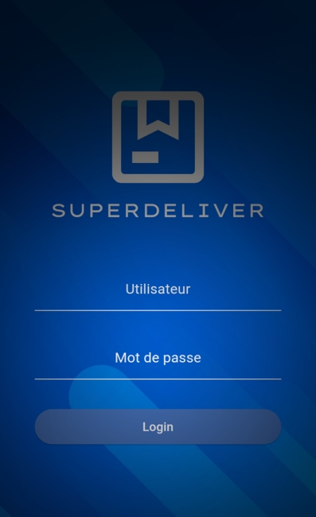
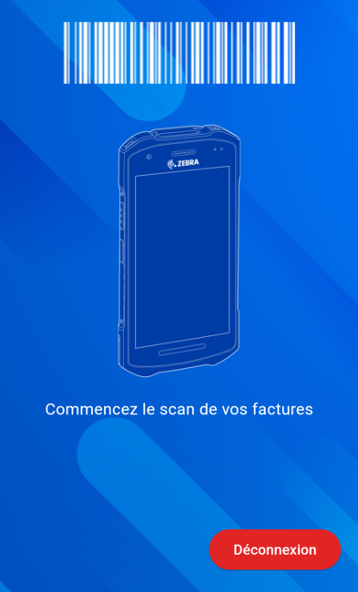
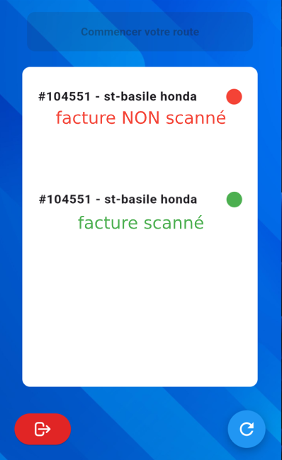
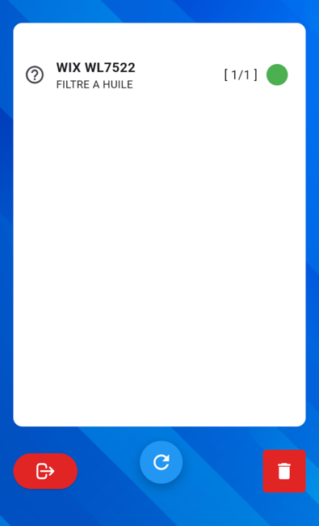
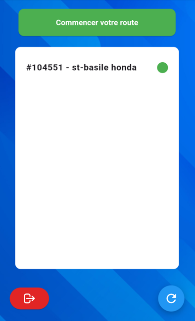
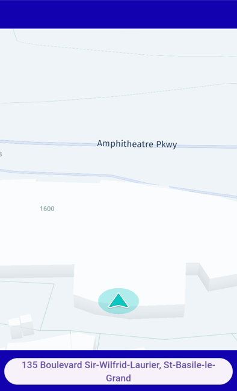
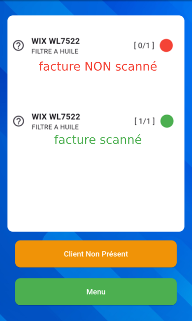
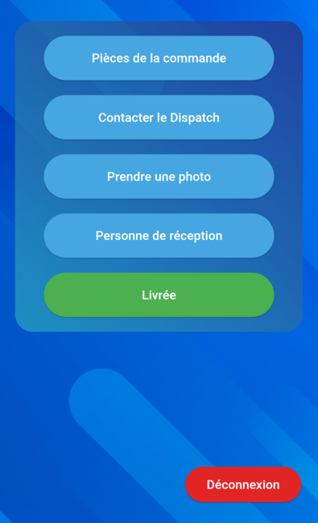

# Guide SuperDeliver (livraison)
***
## Sélection de l'application {#e1}
Pour **ouvrir** l'application de **livraison**, veuillez appuyer sur le bouton **SuperDeliver**.

***
## Connection à votre compte {#e2}
Pour **se connecter** à votre compte, veuillez entrer votre *nom d'utilisateur* dans **Utilisateur** et votre *mot de passe* dans **Mot de passe**.

Une fois que les deux champs sont remplis, pesez sur **Login** pour vous connecter.

*Si après plusieurs tentatives vous n'êtes pas en mesure de vous connecter, veuillez contacter Jonathan.*

***
## Scanner les Factures {#e3}
Utilisez l'un des **boutons physiques jaunes** afin de **scanner le code-barres** situé à gauche dans le bas de chacune de vos factures afin de les ajouter à votre route.

***
## Vérification des Pièces {#e4}
Pour **chacune de vos factures**, devez appuyer sur le nom afin de scanner tous les pièces qui en font partie. Cette procédure assure qu'il ne manque rien.
**==PRENEZ NOTE QUI FAUT SCANNER LES PIÈCES UNE FOIS DANS LA VOITURE!==** 

***
## Scanner les Pièces {#e5}
Utilisez l'un des **boutons physiques jaunes** afin de **scanner le code-barre (UPC)** de chacun de vos articles à l'extérieur du magasin afin de confirmer que vous l'avez bel et bien avec vous.

Exemple de code UPC:

**UNIQUEMENT** Si le barcode est **endommagé** ou **non présent** cliquer sur :grey_question: et faite **OK** cela scannera les items pour vous.

***
## Confirmation des Pièces {#e6}
Lorsque **tous seront scannés**, la **pastille** changera en **vert** et vous devez retourner à la page précédente. Pesez le bouton  pour retourner à la liste de factures. ==**NE PAS UTILISER LE BACK SUR LE TELEPHONE.**==

***
## Commencer votre route {#e7}
De retour sur notre page de factures, lorsque **toutes les pièces de toutes les factures seront bien scannées** vous remarquerez le **button Commencer votre route** sera **vert** et fonctionnelle. 

==**IMPORTANT DE COMMENCEZ LA ROUTE DANS VOTRE VOITURE CELA COMMENCERA VOTRE GPS ET VOTRE TEMPS POUR CHAQUE LIVRAISON!**==

==**NOTEZ QUE VOUS NE POUVEZ PAS RETOURNER EN ARRIÈRE ET RESCANNER DES FACTURES APRÈS LE DEPART DE LA ROUTE!**==

***
## Départ du premier itinéraire {#e8}
Le GPS est maintenant affiché et vous devez **suivre attentivement la route** jusqu'à la **destination**.
Une fois arrivé, veuillez **appuyer sur le bouton** dans le bas contenant l’adresse pour **confirmer votre arrivée.** 
Ensuite, appuyez sur "**OK**".

***
## Remettre les Pièces {#e9}
Lors de la confirmation de votre arrivée vous tomberez sur la page de confirmation du produit. **Rescanner les produits** avec l'un des **boutons physiques jaunes**. Ils tomberont verts lorsque tous les pièces seront bien scannées. 
Une fois que tout **les pieces sont scannées**, veuillez appuyer sur le **bouton menu**.

==**Si le client n'est pas présent**==, **appuyez** sur le bouton **"Client Non Présent"** et ramener la commande en succursale.

***
## Preuve de Livraison {#e10}
Afin de confirmer la livraison, Il est **obligatoire** de prendre une **photo de la réception où prendre le nom** de la personne qui réceptionne les pièces.

**Pièces de la commande** vous permet de retourner en arrière.
**Contacter le dispatch** présente une liste de numéro de téléphone en cas de problèmes.

Une fois **prêt** à partir, **appuyez sur "Livrée"** pour passer à la commande

***
## Fin de la course {#e11}
une fois que toutes vos routes sont terminées, vous devez retourner au magasin afin de recevoir votre prochaine route.